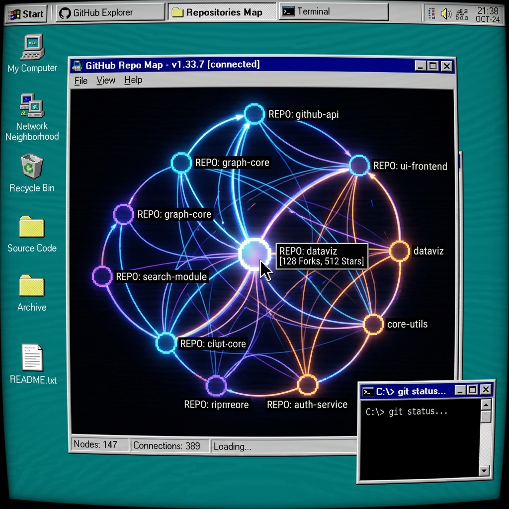
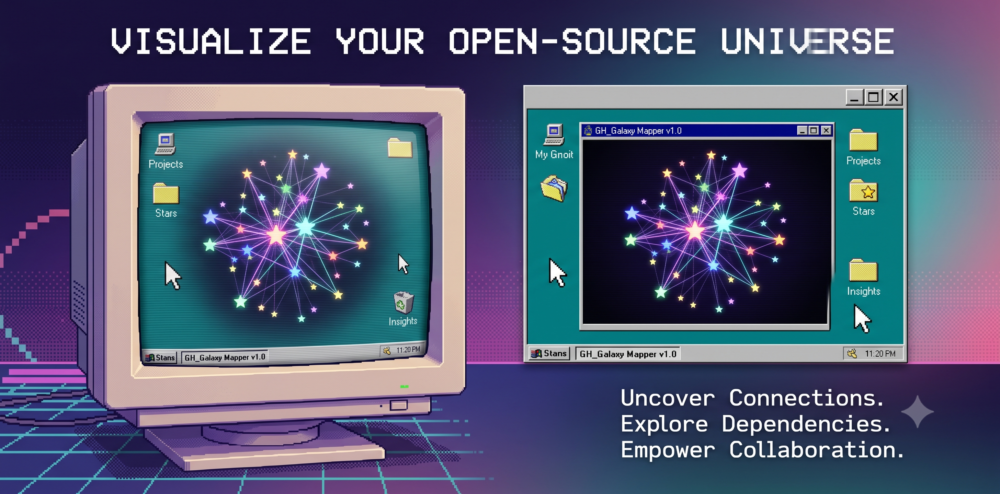
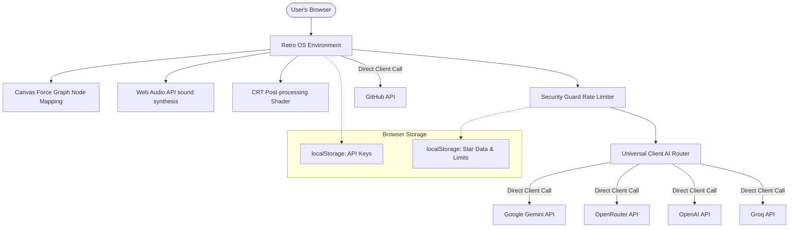

<p align="center">
  
</p>

<h1 align="center">🕸️ GitStars Map - Retro OS Edition v1.0</h1>

<p align="center">
  A nostalgic 90s-2000s desktop operating system environment (styled like Windows 95/98) running inside the browser to explore and map your GitHub Stars, resembling Obsidian's force-directed graph view.
</p>

<p align="center">
  <a href="https://git-start.vercel.app/">
    
  </a>
</p>

<p align="center">
  <strong>⚡ Try it online! Link your read-only token and explore your stars instantly: <a href="https://git-start.vercel.app/">git-start.vercel.app</a> ⚡</strong>
</p>


<p align="center">
  
  
  
  
  
</p>

<p align="center">
  <a href="#-features">Features</a> •
  <a href="#-security-first-architecture">Security Architecture</a> •
  <a href="#%EF%B8%8F-how-it-works">How It Works</a> •
  <a href="#-getting-started">Getting Started</a> •
  <a href="#-technical-stack">Tech Stack</a>
</p>

---

## 🚀 Features

*   📺 **Nostalgic CRT Monitor Shader:** CSS-driven scanlines, vignetting, phosphor glowing, and subtle flicker filters that can be toggled on/off via the taskbar tray.
*   🪟 **Draggable Retro Windows:** Multiple windows for Settings, Help, Mind Map Graph, and Properties. Windows support dragging, Z-index focusing, and minimizing.
*   🔊 **Real-time 8-Bit Audio Synthesis:** Dynamic micro-beeps synthesized on the fly using the Web Audio API (success chirps, error buzzes, click responses, and floppy drive seek clicks during loading).
*   🤖 **Universal Client-Side AI Router:** Connects directly from your browser to:
    *   **Google Gemini API** (Free Tier supported natively via AI Studio)
    *   **OpenRouter** (Aggregated access to free and cheap models)
    *   **OpenAI** (GPT-4o-mini, custom URLs)
    *   **Groq** (Llama 3)
    *   **Custom Endpoints** (e.g., Ollama or custom API proxies)
*   🛡️ **100% Billing Protection:** Built-in **Local Rate Limiter Security Guard** checks counts in `localStorage` and client-side blocks requests exceeding 15/min or 1500/day. Standard free-tier Google AI Studio accounts will return `HTTP 429` (Too Many Requests) rather than rolling over to billing.
*   🕸️ **Obsidian-Style Mind Map:** Interactive Canvas 2D force-directed graph rendering repo and category nodes. Stars are sized logarithmically by star counts and color-coded by programming language, connected with animated data stream particles.

---

## 📸 Screenshots & Artwork

<p align="center">
  
</p>

<p align="center">
  
  
</p>
<p align="center">
  
  
</p>

---

## 🔒 Security-First Architecture

We take privacy and API billing security seriously:

1.  **Zero Server Backend:** No databases, no proxy servers. All API key variables are entered by visitors, saved in their browser's private `localStorage`, and executed directly to GitHub/Google endpoints.
2.  **No Hardcoded Keys:** Your source code is 100% clean of API keys. No secrets are committed or stored on servers.
3.  **Local Rate Limiting Guard:** Even if your API keys are loaded, the browser strictly rate-limits requests to protect you from unexpected bill spikes or API bans.

---

## 🕹️ How It Works



---

## 📦 Getting Started

### Prerequisites

You will need:
1.  **Node.js** (v18+)
2.  **Google Gemini API Key** (optional, but needed for AI mapping): Get one for free at [Google AI Studio](https://aistudio.google.com/).
3.  **GitHub PAT** (optional, recommended): Generate a read-only token for public scopes on [GitHub Settings](https://github.com/settings/tokens).

### Running Locally

1.  Clone or navigate to the directory:
    ```bash
    git clone https://github.com/yourusername/github-stars-visualizer.git
    cd github-stars-visualizer
    ```
2.  Install dependencies:
    ```bash
    npm install
    ```
3.  Launch the development server:
    ```bash
    npm run dev
    ```
4.  Run unit tests (TDD suite):
    ```bash
    npm test
    ```

---

## 🏗️ Technical Stack

*   **UI Framework:** React 19 + Vite 8
*   **Graph Renderer:** Canvas-based `force-graph`
*   **Styling:** Vanilla CSS (retro custom bevels & layouts)
*   **Test Suite:** Vitest (15 unit tests verifying rates, routers, and graph builders)
*   **Sound Synth:** Native HTML5 Web Audio API

---

## 🤝 Contributing

We welcome contributions! Please read our [Contributing Guidelines](CONTRIBUTING.md) to get started on setting up the local dev environment, styling specifications, and TDD workflow instructions.

---

## 💎 Credits & Open Source Acknowledgements

This project was built possible by these fantastic open-source libraries, assets, and inspirations:

*   **Frontend & Tooling:** [React 19](https://react.dev/), [Vite 8](https://vite.dev/), [ESLint](https://eslint.org/)
*   **Data Visualization:** [force-graph (HTML5 Canvas)](https://github.com/vasturiano/force-graph) by Vasco Asturiano
*   **AI Integration:** [@google/generative-ai SDK](https://github.com/google/generative-ai-js)
*   **Icons:** [Lucide React](https://lucide.dev/)
*   **Testing Suite:** [Vitest 4](https://vitest.dev/)
*   **Typography:** [Google Fonts: VT323](https://fonts.google.com/specimen/VT323) (nostalgic pixel font) and [Google Fonts: Courier Prime](https://fonts.google.com/specimen/Courier+Prime) (monospace console font)
*   **Visual Style & Retro Design:** Classic Windows 95/98 styling and beveled theme designs.

---

## 📄 License

This project is licensed under the MIT License - see the LICENSE file for details.


